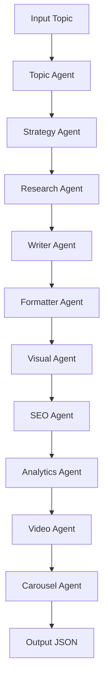

## How to Add a New Agent

To add a new agent to the CrewAI pipeline:
1. **Create Agent Module:**
	- Add a new file in `content_factory/agents/` (e.g., `new_agent.py`).
	- Implement a function with the signature: `def generate_new_agent(topic: str, content: str, key_points: List[str], tone: str) -> Dict[str, Any]`.
	- Return a dictionary with agent-specific outputs.
2. **Update AGENTS Dictionary:**
	- Add the new agent to the `AGENTS` dictionary in `content_factory/api/routes.py`.
	- Set default enabled status and provide a description if needed.
3. **Integrate in Pipeline:**
	- Update `generate_monthly_content` in `content_factory/pipelines/monthly_content_pipeline.py` to include the new agent output, using an `include_new_agent` flag.
	- Add logic to call the new agent function and attach its output to each content item.
4. **Frontend Integration:**
	- Add a checkbox for the new agent in the frontend UI (`frontend/pages/index.js`).
	- Ensure agent output is displayed in the content item view.
5. **Database Model:**
	- Add a new field to the `ContentItem` model in `content_factory/database/models.py` if persistent storage is needed.
	- Update Alembic migration scripts as required.
6. **Testing:**
	- Add unit tests for the new agent in `tests/`.
	- Expand endpoint and pipeline tests to cover the new agent output.
7. **Documentation:**
	- Update README.md and ARCHITECTURE.md to document the new agent and its output fields.
# Project Architecture

## Overview
This project uses a modular CrewAI pipeline for dental content generation, with each agent responsible for a single task. The system is designed for extensibility and integration with FastAPI and Next.js.

## Sprint Goals
- Document and diagram full data flow (input → agents → output)
- Define API schemas and error handling for frontend consumption
- Scaffold database models and migration plan
- Add stubs/interfaces for future agents (SEO, analytics, video, etc.)
- Update extension points for easy scaling and integration
- Plan for Dockerization and cloud deployment

## Architectural Roadmap
1. **Frontend Integration**: Define API contract, document request/response shapes, add CORS support
2. **Extensibility**: Prepare agent stubs, document extension points
3. **Persistence**: Scaffold database models, plan migrations
4. **Scalability**: Dockerfile, deployment scripts, cloud readiness

## Data Flow

## Agents

	- **Topic Agent**: Generates subtopics
	- **Strategy Agent**: Assigns category/tone
	- **Research Agent**: Gathers key points
	- **Writer Agent**: Produces content
	- **Formatter Agent**: Formats for platforms
	- **Visual Agent**: Suggests visuals
	- **SEO Agent**: Optimizes content for search engines
	- **Analytics Agent**: Provides content performance insights
	- **Video Agent**: Generates video content
	- **Carousel Agent**: Creates carousel visual content

## Agent Output Fields
Each content item includes the following agent outputs:
- `content`: Platform-formatted content (Formatter Agent)
- `visuals`: Visual prompts/scripts (Visual Agent)
- `seo`: SEO metadata (SEO Agent)
- `analytics`: Performance metrics (Analytics Agent)
- `video`: Video script/meta (Video Agent)
- `carousel`: Carousel slides/meta (Carousel Agent)

## Pipeline Steps
1. Input topic is processed by Topic Agent to generate subtopics
2. Strategy Agent assigns category/tone
3. Research Agent gathers key points
4. Writer Agent produces content
5. Formatter Agent formats for platforms
6. Visual Agent suggests visuals
7. SEO, Analytics, Video, Carousel Agents generate respective outputs
8. All outputs are aggregated into a content item and saved to DB
9. Frontend displays agent outputs per content item

## Orchestration
- Crew and pipeline modules coordinate agent execution and output aggregation
- Extension points allow easy addition of new agents or services

## API Contract
- All endpoints documented with request/response shapes
- Content CRUD endpoints and monthly generation now include agent output fields: `seo`, `analytics`, `video`, `carousel`
- Error handling standardized for frontend consumption

## Database Integration (Planned)
- Models scaffolded in `content_factory/database/models.py`
- ContentItem model and migrations now include agent output fields: `seo`, `analytics`, `video`, `carousel`
- Migration plan updated for new fields

## Scaling & Deployment
- Dockerfile and deployment scripts planned for cloud readiness

## Diagrams & Flowcharts
- See above Mermaid diagram for agent pipeline

## Extension Points
- Agents are modular and replaceable
- Crew and pipeline orchestration allows easy scaling
